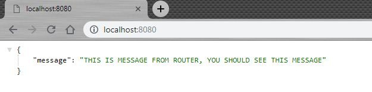
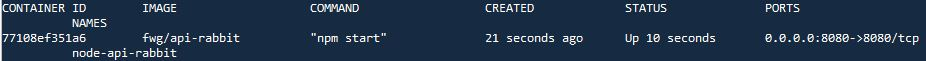

# Nodejs API to Rabbitmq

  repository นี้ เป็น API เขียนจาก nodejs (express) เพื่อส่ง message เข้าไปที่คิวของ rabbitmq service
  rabbitmq service จะมี c รอรับอ่านคิว เพื่อคิวรี่เอาข้อมูลและส่งกลับมาที่ api, api จะส่งต่อไป client/requester

# 1. Run ด้วย Nodejs

## Prerequisites
   
   
  
   
  
  - `Nodejs` >= 8.9.4 (test on Windows), 8.11.3 (test on Ubuntu16) [Official Download](https://nodejs.org/en/download/)
  - `Source code` (compressed file) [Download on Gitlab](http://gitlab.freewillgroup.com/peerapat_suk/node-api-rabbitmq)
  - `Rabbitmq server` (Assume broker running on `amqp://localhost`) [Download](https://www.rabbitmq.com/)


## ติดตั้ง
### --> ถ้าเชื่อมต่อ Internet ได้ 
  Install dependencies

  ```sh
  unzip node-api-rabbitmq-master.zip
  cd node-api-rabbitmq-master
  npm install
  ```
  
  ```sh
  git clone {this_repo_url.git}
  cd node-api-rabbitmq
  npm install
  ```
  * หลังจากสั่งคำสั่ง `npm install` เสร็จ, ควรจะมีโฟลเดอร์ `node_modules` ขึ้นมา

### --> ถ้าเชื่อมต่อ Internet ไม่ได้

  ให้ดาวโหลดโฟลเดอร์ `node_modules` มาใส่แทน จาก path:
  ```sh
  \\nas1\securities\SDP\user\prs\RabbitMQ\api_rabbitmq_node_modules.zip
  ```
  ย้ายไฟล์ .zip ไปที่โฟลเดอร์ของโปรเจ็คนี้ แล้วแตกไฟล์ .zip
  ```sh
  mv api_rabbitmq_node_modules.zip node-api-rabbitmq-master
  unzip api_rabbitmq_node_modules.zip
  ```

  - ถ้าเกิด error `'permission denied rimraf...'` ให้ chmod permission **.bin** ใน **node_modules**

  ```sh
  chmod a+x node_modules/.bin/*
  ```

---

## วิธีสตาร์ท
  หลังลง dependencies แล้ว ให้สั่งคำสั่ง 
  ```
  npm start
  ```
  - default NODE_ENV คือ development (มองเห็น log dev, log request router ออกจอ)
  - default port คือ **3000** (TODO: config port)
  - default uri amqp คือ amqp://localhost

  *ถ้าสตาร์ท production mode (ไม่เก็บและไม่เห็น log dev, เก็บ log ลงไฟล์)
  ```sh
  NODE_ENV=production npm start
  ```

  *ถ้าสตาร์ทด้วย docker ต้องใช้ uri amqp ของ container
  ```sh
  AMQPURI=amqp://172.17.xx.xx NODE_ENV=production npm start
  ```

  แล้วเช็ค
  ```sh
  // ON TERMINAL
  curl localhost:3000/ 

  // ON BROWSER
  localhost:3000
  ```

  หน้าจอจะแสดงผล
  
  

---

  ตัวอย่าง
  **Request Okury (sent message to queue `test_queue`)**
  ```sh
  curl localhost:3000/rpc/test_queue/APF50050005%20%20,F,5005,,1,8
  curl localhost:3000/rpc/test_queue/AMU1017,10170012%20%20,1,10
  ```
---

# 2. build source เป็น docker image แล้วสตาร์ทจาก docker

  สเต็บนี้จะเป็นการ build source ให้เป็น docker image แทน ในกรณีที่เครื่องไม่สามารถลง nodejs ได้โดยตรง แต่ใช้ docker ได้
  
## สิ่งที่ต้องมี

  - **ต้องมี** Internet access !!
  - ลง **Docker** แล้ว
  - มี Docker image `Node` ซึ่ง `repo:tag` ควรที่จะ **>= `node:10.10.0-alpine`**  
    สามารถดึง image ได้จากคำสั่ง
      
      ```sh
      docker pull node:10.10.0-alpine
      ```
  - `Source code` ( ไฟล์ดูจาก #1 )

---
  TODO: If no internet access build instruction 
  - See above adapt with  `# Setup with no internet access`
  - Then edit Dockerfile to not `npm install`
  - Add `RUN chmod a+x node_modules/.bin/*`  
  - Follow normal build step

---

### ถ้าต้องการข้าม Step build ต้องการให้รัน Docker image เลย
  - ดาวโหลด:

      ```sh
      \\nas1\securities\SDP\user\prs\RabbitMQ\Docker Images\NodeRB_DockerImage.tar
      ```
    แล้วข้ามไป Step 4 ได้เลย

## Step การ Build

  1. Extract .zip file แล้ว cd ไปที่ `node-api-rabbitmq-master/` (โฟลเดอร์ที่ได้จากการแตกไฟล์)

      ```sh
      // ถ้าใช้ zip แตกไฟล์
      unzip node-api-rabbitmq-master.zip

      // ถ้าใช้ tar แตกไฟล์
      tar -xvzf node-api-rabbitmq-master.tar.gz

      cd node-api-rabbitmq-master/
      npm install
      ```
  2. สั่งให้ build docker image (จะรันโค้ดตามไฟล์ชื่อ `Dockerfile`)

      ```sh
      docker build -t fwg/api-rabbit .
      ```

      เช็คว่าได้ image หรือยัง จากคำสั่ง

      ```sh
      docker images
        REPOSITORY                TAG                 IMAGE ID            CREATED              SIZE
        fwg/api-rabbit            latest              d8457d449ae1        About a minute ago   96.6 MB
      ```
      - **fwg/api-rabbit** สามารถเปลี่ยนเป็นชื่อ repository อะไรก็ได้
  3. สั่งให้ Export image บน docker กลายเป็นไฟล์ .tar

      ```sh
      docker save -o NodeRB_DockerImage.tar fwg/api-rabbit
      ```
      - `NodeRB_DockerImage.tar` ชื่อไฟล์หรือpathที่จะ export ออกมา (ต้องใส่ .tar ด้วย)
      - `fwg-api-rabbit` ชื่อ repository บน docker

  - `ตอนนี้จะต้องได้ไฟล์ 'NodeRB_DockerImage.tar' !!`

  4. หลังจากได้ Image ไฟล์ ให้ copy ไฟล์ไปวางไว้ที่ Server แล้ว Load image ขึ้น Docker ด้วยคำสั่ง

      ```sh
      docker load -i NodeRB_DockerImage.tar
      ```

      เช็คว่ามี Image จากคำสั่ง

      ```sh
      docker images
          REPOSITORY          TAG                 IMAGE ID            CREATED             SIZE
          fwg/api-rabbit      latest              a2554eac0192        8 seconds ago       95.8MB
      ```

  5. สตาร์ท Container จาก Image ด้วยคำสั่ง

      ```sh
      docker run -d \
        -e "NODE_ENV=development" -e "AMQPURI=amqp://10.22.26.xx" \
        --name node-api-rabbit \
        -p 3000:3000 \
        -m "300M" \
        fwg/api-rabbit \
        npm start 
      ```
      - `-d` รันแบบ background. 
      - `--name` เปลี่ยนชื่อ container 
      - `-p` แมพพอร์ตจาก **'hostport':'containerport'**  
      - `fwg/api-rabbit` ชื่อ Repository Image ที่จะเอามารัน
      - `npm start` Execute command, if not provided will use default command from Dockerfile.
      - `-m` Limit the max memory use of this container.
      - `-e ENV=value` pass Parameter ชื่อ ENV ค่า value เข้า Nodejs  

      **ENVIRONMENT LIST**
      - สามารถดู config อื่นๆ ได้ที่ `lib/config.js`
      - **NODE_ENV** Mode ที่จะสตาร์ท Nodejs, Default ถ้าไม่ส่งค่าคือ development (ถ้าใช้จริงควรส่งค่า `production`). ex NODE_ENV=production
          - `development` จะแสดง DevLog ของการเรียกฟังก์ชันต่างๆ และเก็บลงไฟล์ที่ `logs/messages_dev/` + แสดง log Request api และเก็บลงไฟล์ที่ `logs/` 
          - `production` จะแสดงเฉพาะ log NodeRB ที่สำคัญๆ และเก็บลงไฟล์ไว้ที่ `logs/messages/` + ไม่แสดง log Request api แต่เก็บลงไฟล์ log
      - **PORT** เลข port ที่ต้องการให้ Nodejs สตาร์ท (Default เมื่อไม่ส่งคือ 3000). ex PORT=8000
          - ต้องแมพ -p ให้ตรงด้วย
      - **AMQPURI** กำหนด rabbitmq uri.
          - ถ้า amqp รันด้วย docker(ไม่ใช่ service/process ที่ลงเองบนเครื่อง) ให้ใช้ ip ของ docker container แทน ip เครื่อง เช่น `amqp://172.17.0.x` (ดูจาก docker network inspect bridge)
          - ถ้า logs จาก node ขึ้น ACCESS_ERROR อาจจะต้อง login ด้วย account จะใช้ uri รูปแบบ `amqp://username:password@ip`  
          - อื่นๆ [URI SPEC](https://www.rabbitmq.com/uri-spec.html) for more.
      - **REPLYWAITTIME** เวลาที่จะให้รอการ response เมื่อขอ msg แบบ RPC (default 6000) ในหน่วย ms. ex REPLYWAITTIME=6000
    
      แล้วดู Container จากคำสั่ง
      
      ```sh
      docker ps
      ```
      
      
  6. ดูว่า Container สตาร์ทและใช้งานได้จริงจากคำสั่ง

      ```sh
      // ON TERMINAL
      curl localhost:3000/ 

      // ON BROWSER
      localhost:3000
      ```

      ควรจะได้ตอบกลับตามนี้
      
       

      Request Okury(sent message to queue `test_queue`)
      ```sh
      curl localhost:3000/rpc/test_queue/APF50050005%20%20,F,5005,,1,8
      curl localhost:3000/rpc/test_queue/AMU1017,10170012%20%20,1,10
      ```

  7. ดู Container log (พวกที่ออก Console ของ Nodejs) จากคำสั่ง

      ```sh
      docker logs 771 -f 
      ```
      - `771` 3 ตัวแรกของ Container ID/ชื่อ Container
      - `-f` Follow log output

  8. Test tool

      ```sh
      ./api_loop_test.sh <port>
      ```
      * `<port>` API Port

---

# RabbitMQ
ส่วนนี้เป็นวิธีสตาร์ท RabbitMQ Service ขึ้นมา
## สตาร์ทจาก Docker Image ของ Rabbitmq
  * ถ้าต้องใช้ Internet Access !!  
   Pull image จากคำสั่ง
    ```sh
    docker run -d --name rabbit -p 5672:5672 -p 15672:15672 rabbitmq:3-management
    ```
    - `5672` AMQP Port
    - `15672` Management Port

  * ถ้าไม่มี Internet Access!
   ให้ทำการ Load ไฟล์ Image มาใช้แทนการ Pull (เหมือนการสตาร์ท Nodejs) ไฟล์อยู่ที่:
    ```sh
    \\nas1\securities\SDP\user\prs\RabbitMQ\Docker Images\rabbitmq_3-management.tar

    // copy ไปที่ server แล้ว Load ขึ้น Docker
    docker load -i rabbitmq_3-management.tar
    ```
    แล้วสั่งคำสั่ง:
    ```sh
    docker run -d --name rabbit -p 5672:5672 -p 15672:15672 rabbitmq:3-management
    ```
#### ถ้าต้องการลง Service แบบไม่ใช้ Docker [Click](https://www.rabbitmq.com/download.html) .

---

# API
available end point API ที่มี

กำหนด base url คือ 
```sh 
 http://localhost:3000
```

- `spacebar` หรือช่องว่างต้องแทนด้วย `%20`  
  
## BASE
#### **`/`**
  - **METHOD** : GET
  - **DESCRIPTION** : index page
  - **PARAMETERS** : -
  - **EX** : localhost:3000/
  - **RESPONSE** : -

#### **`/version`**
  - **METHOD** : GET
  - **DESCRIPTION** : ดูเวอร์ชันของ API
  - **EX** : localhost:3000/version
  - **RESPONSE** : API Version xx.xx.xx.xx (html)
  
## RPC
 ส่ง message เข้าคิว RPC API จะรอตอบกลับจาก Server แล้วตอบ Client

#### **`/rpc`**
- **METHOD** : GET
- **DESCRIPTION** : index page of rpc
- **PARAMETERS** : -
- **EX** : localhost:3000/rpc/
- **RESPONSE** : -

#### **`/rpc/:queue/:message`**
  - **METHOD** : GET
  - **DESCRIPTION** : ดูเวอร์ชันของ API
  - **PARAMETERS** :
    - **:queue** : ชื่อ rpc queue ที่จะส่ง
    - **:message** : msg ที่จะส่ง
  - **EX** : localhost:3000/rpc/test_queue/AMU1017,10170012%20%20,1,10
  - **RESPONSE** : ยังไม่มี format  

## DIRECT
 ส่ง message เข้า direct queue
#### **`/direct`**
  - **METHOD** : GET
  - **DESCRIPTION** : index page of direct
  - **PARAMETERS** : -
  - **EX** : -
  - **RESPONSE** : -  

---

# MY DEV NOTE
  Nothing to see here, you can delete all this below.
## RabbitMQ Maintainance
  All available detail. [See more](https://www.rabbitmq.com/rabbitmqctl.8.html)
### Plugin
- Management - เป็นหน้าเว็บ Monitor. จัดการ rabbitmq
  ```sh
  rabbitmq-plugins enable rabbitmq_management
  ```
### COMMAND
อาจต้อง sudo ด้วย  

- สร้าง Admin user บน rabbitmq
  ```sh
  rabbitmqctl add_user test test
  rabbitmqctl set_user_tags test administrator
  rabbitmqctl set_permissions -p / test ".*" ".*" ".*"
  ```
  - [ดู User Management อื่นๆ](https://www.rabbitmq.com/rabbitmqctl.8.html#User_Management)  

- ปิด/เปิด App
  ```sh
  rabbitmqctl start_app
  rabbitmqctl stop_app
  ```
- Reset rabbitmq
  ```sh
  rabbitmqctl stop_app
  rabbitmqctl reset
  rabbitmqctl force_reset
  ```
#### Queue
- ลบ messages ทั้งหมดทิ้ง
  ```sh
  rabbitmqctl purge_queue 
  ```
- ดู list_queues, list_exchanges and list_bindings
  ```sh
  rabbitmqctl list_* 
  ```
-  [-> Server Status](https://www.rabbitmq.com/rabbitmqctl.8.html#Server_Status) อื่น ๆ

#### Other
- Report
  ```sh
  rabbitmqctl report > server_report.txt
  ```

---
## ERROR
  ```
  TypeError: Cannot read property 'createChannel' of undefined
  ``` 
 - Change the uri, Dedicate that not found specific uri.
## COMMAND
  ```sh
  // Go in container
  docker exec -it <id> sh

  // execute <command> to container (ex. npm start)
  docker exec -it <id> <command>
  ```
## Connect to Rabbitmq
### From Container
 
  ```sh
  docker network inspect bridge
  ```
To see the ip4 of the container

Then on .js where is `amqp://localhost` change this to `amqp://172.17.0.x` follow the rabbitmq container's ip

### From Outside Container

  Maybe `amqp://localhost` or `amqp://127.0.0.1` or `amqp://0.0.0.0` or use with port `5672`

If edit src in docker container make sure you did `docker exec -it <3cid> npm run build` then `docker restart <3cid>`
- `<3cid>` is first 3 character of CONTAINER ID.

`TODO:` Make shell script to run with custom port which set by user or config. \
`TODO:` Dynamic log file to server's folder (since Ifrit cannot execute docker without root permission).

Test with nodejs on docker exec
  
  ```sh
    docker run -d -it --name nodejs10 -v "$(pwd)":/home -w /home node:10.10.0-alpine

    docker exec -it 886 <cmd>
  ```

  ```sh
    docker network inspect bridge

  ```

  


